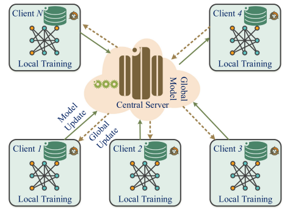

#   **ATTACK DETECTION AND MITIGATION VIA FEDERATED LEARNING**

## Table of Contents

1. [Introduction](#1-introduction)
2. [Key Concepts](#2-key-concepts)

   2.1 [Federated Learning (FL)](#21-federated-learning-fl)
3. [Attack Detection with Federated Learning](#3-attack-detection-with-federated-learning)

   3.1 [Types of Attacks in FL Systems](#31-types-of-attacks-in-fl-systems)
   
   3.2 [Approaches and Methodologies](#32-approaches-and-methodologies)
4. [FL Aggregation and Optimization Techniques for Cybersecurity](#4-fl-aggregation-and-optimization-techniques-for-cybersecurity)
   
   4.1 [Classical FL Algorithms](#41-classical-fl-algorithms)
   
   4.2 [Advanced and Recent Algorithms](#42-advanced-and-recent-algorithms)
   
5. [Mitigating Attacks in FL](#5-mitigating-attacks-in-fl)
   
   5.1 [Attacks Against FL](#51-attacks-against-fl)
   
   5.2 [Defense and Mitigation Strategies](#52-defense-and-mitigation-strategies)
   
6. [Comparison of Existing Work](#6-comparison-of-existing-work)
7. [Common Techniques and Innovations](#7-common-techniques-and-innovations)
8. [Limitations, Open Challenges, and Future Directions](#8-limitations-open-challenges-and-future-directions)
9. [Conclusion](#9-conclusion)
10. [References and Resources](#10-references-and-resources)

---

## 1. Introduction

### Objectives:

With the rise of IoT and distributed systems, intrusion detection has become a critical challenge. Federated Learning (FL) offers a promising alternative by enabling collaborative learning while preserving data privacy. This SOTA (State of the Art) presents recent works that combine FL with attack detection and mitigation techniques.

### Context:

* Growth of IoT and need for distributed detection
* Limitations of centralized ML methods: privacy, bandwidth, data heterogeneity

### Motivation for FL:

* Privacy preservation
* Scalability
* Adaptability to distributed environments

---

## 2. Key Concepts

### 2.1 Federated Learning (FL)

**Definition and principles**

Federated Learning (FL) is a decentralized machine learning approach introduced by Google in 2016. It allows multiple devices or organizations to collaboratively train a shared model without exchanging raw data. Instead, only model parameters are shared, preserving local data privacy.
Advantages
---
| Pros                              | Explanation                                           |
| --------------------------------- | ----------------------------------------------------- |
| Privacy-preserving                | No need to share sensitive data                       |
| Training is distributed           | Reducing **central server burden**                    |
| Enable collaborative intelligence | Across devices, hospitals, banks, vehicles, etc.      |
| Applicable to edge computing      | Suitable for smartphones, smart homes, vehicles, etc. |

## **Challenges**

| Cons                   | Explanation                                                  |
| ---------------------- | ------------------------------------------------------------ |
| Communication overhead | Frequent parameter exchanges slow down training              |
| System heterogeneity   | Different devices have varying capacities and connection qualities |
| Data heterogeneity     | Data is non-IID (not independently and identically distributed) across clients. |

Another challenge is the security vulnerabilities :

- **Membership inference attacks**: Adversaries can guess if specific data was used.
- **Malicious clients**: Can poison the model intentionally.
- **Privacy leakage risks**: Even without sharing raw data, aggregated updates can reveal patterns.

**Difficult to detect malicious participants** in distributed environments.

## **Use cases**

| Case                              | Explanation                                                  |
| --------------------------------- | ------------------------------------------------------------ |
| Health care                       | Training models on patient data across hospitals without sharing EHRs |
| Transportation                    | Real-time model updates from smart vehicles or traffic systems |
| Finance                           | Banks can collaboratively assess loan  risks without exposing customer data |
| NLP (Natural Language Processing) | Training personalized keyboards and language models on user devices like phones without exposing typed data |

## **Why Federated Learning?**

- Centralized training isn't always feasible due to:
  - **Data privacy laws** (e.g., GDPR, HIPAA)
  - **Risk of breaches**
  - **Bandwidth and storage limits**
- FL enables **decentralized, privacy-respecting learning** while still achieving strong performance.

Encourages **collaborative AI development** across organizations or regions with data silos.

## How Federated Learning Works

Federated Learning (FL) operates in iterative rounds with two main phases:

### Local Model Update
- A subset of clients is selected
- They receive the current global model from the FL server
- Each client trains the model locally using its private data

### Global Aggregation
- Clients send their locally updated model parameters back to the server
- The server aggregates the updates to form a new global model

This process is repeated until performance goals are achieved.

## Types of Federated Learning Architectures

| Type                                    | Description                                                |
| --------------------------------------- | ---------------------------------------------------------- |
| **Horizontal Federated Learning (HFL)** | Clients share the same feature space but different samples |
| **Vertical Federated Learning (VFL)**   | Clients share the same samples but have different features |
| **Federated Transfer Learning (TFL)**   | Clients have different features and different samples      |

## Definitions

## **Feature Space**  

These are the **columns** of a dataset. Each *feature* is a variable or attribute used to describe an observation. 
**Example**: In a medical dataset, features could be: `age`, `blood pressure`, `glucose level`, etc.

### **Samples (or Observations)**  
These are the **rows** of a dataset. Each row represents an individual case or observation.  

**Example**: A patient, a transaction, a network connection…

---

## Visual Example

| ID (Sample) | Age (Feature) | Glucose (Feature) | Label (Attack?) |
| ----------- | ------------- | ----------------- | --------------- |
| 1           | 45            | 120               | No              |
| 2           | 52            | 140               | Yes             |
| ...         | ...           | ...               | ...             |

- **Features**: `Age`, `Glucose`, etc. → columns  
- **Samples**: rows (each patient or event)

## Summary in the Context of Federated Learning (FL)

| Architecture                            | Sharing Between Clients                   | Examples                                                     |
| --------------------------------------- | ----------------------------------------- | ------------------------------------------------------------ |
| **Horizontal Federated Learning (HFL)** | Same *feature space*, different *samples* | Several hospitals collecting the same types of data from their own patients |
| **Vertical Federated Learning (VFL)**   | Same *samples*, different *features*      | A bank and a hospital sharing information about the same users, but with different data types |
| **Federated Transfer Learning (TFL)**   | Different *features* and *samples*        | Two entirely different organizations learning a joint model via knowledge transfer |

## **3. Detecting Cyberattacks with Federated Learning**

### **3.1 What Kinds of Attacks Can Be Detected with FL?**

Federated Learning is used to detect many types of cyberattacks. These attacks usually fall into the following categories:

#### **Network Attacks**

- **DDoS (Distributed Denial-of-Service)**: These try to overwhelm systems with traffic.
  - **UDP, TCP, ICMP, and HTTP Flooding**: These are types of DDoS attacks using different internet protocols.

#### **Malware and Exploits**

- **Ransomware**: Encrypts your data and asks for payment.
- **SQL Injection**: Tricks databases into revealing or changing data.
- **XSS (Cross-site Scripting)**: Injects scripts into websites.
- **Backdoor Attacks**: Hackers insert hidden access points into the system.
- **Uploading Attacks**: Uploading harmful files to systems.

#### **Reconnaissance and Scanning**

- **Port Scanning**: Looks for open doors in a system.
- **Vulnerability Scanning**: Searches for weak points in the network.
- **Fingerprinting**: Identifies devices or software for later targeting.

#### **Access and Interception Attacks**

- **Password Brute-force**: Tries many passwords to break into a system.	
- **Man-in-the-Middle (MITM)**: Intercepts messages between two devices.

#### **Insider Threats**

- Attacks that come from inside the organization, like employees misusing access.

#### **Advanced Threats**

- **Advanced Persistent Threats (APT)**: Long-term targeted attacks.
- **Phishing**: Tricks people into giving away personal or login information.

These attacks can be found by analyzing network traffic, user behavior, or log files—especially when many devices work together in an FL system.

### **3.2 How FL Detects These Attacks**

To detect cyber threats, FL systems use several smart techniques:

#### 3.2.**1. Learning Models Used**

- **Convolutional Neural Networks (CNNs)**: Good for analyzing patterns like images or traffic.
- **Recurrent Neural Networks (RNNs)**: Useful for time-based data like logs.
- **Transformers and Autoencoders**: Used for more complex or hidden patterns.

#### 3.2.**2. Datasets for Training**

These models are trained using real cybersecurity datasets such as:

- **CIC-IDS2017**
- **TON-IoT**
- **BoT-IoT**
- **N-BaIoT**
- **UNSW-NB15**

#### 3.2.**3. How the Learning is Done**

- Each device (or “agent”) trains locally on its own data.
- Agents calculate their **accuracy** and **F1-score** (a way to measure performance).
- These scores help decide which agents are doing well.

#### 3.2.**4. Choosing the Best Devices**

- Only the best-performing devices share their updates.
- The updates are combined using **Secure Aggregation** (SAC) to protect privacy.
- Devices that didn't perform as well receive the improved model using **transfer learning**, so they still benefit.

#### 3.2.**5. Secure and Private Training**

- FL uses **Secure Multi-Party Computation (SMPC)** and **Homomorphic Encryption (HE)** to protect sensitive data.
- These methods make sure no one can see other people's data or reverse-engineer it.

#### 3.2.**6. Detecting Suspicious Behavior**

- FL systems use **clustering** to detect outlier updates that could mean an attack.
- **Client reputation systems** assign trust scores to devices based on past behavior.

### **3.3 What Makes FL Special for Cybersecurity?**

Federated Learning is perfect for environments like industrial IoT (IIoT), smart grids, and healthcare where:

- Data is spread across many devices
- Privacy is crucial
- Attacks happen often but data cannot be centralized

With FL, we can catch cyberattacks early without exposing private data. It's a smart way to build strong defenses across systems that are both large and distributed.

---

## **4. Federated Learning Aggregation and Optimization Techniques for Cybersecurity**

Federated Learning (FL) relies on combining updates from multiple clients to build a global model. To make this process efficient, accurate, and secure especially in cybersecurity settings different techniques have been developed. These are grouped into **classical** and **advanced** methods.

### **4.1 Classical FL Algorithms**

These algorithms form the foundation of FL and are commonly used in both research and practical applications:

| Algorithm Name                                     | Description                                                  |
| -------------------------------------------------- | ------------------------------------------------------------ |
| **FedAvg (Federated Averaging)**                   | The most basic and widely used FL method. Clients train models locally, and the server averages them into a global model. Simple and effective but struggles with highly non-IID data. |
| **FedProx (Federated Proximal)**                   | Extends FedAvg by adding a proximal term to the objective function, which helps address heterogeneity in client data and system performance. |
| **FedOpt (Federated Optimization)**                | A family of algorithms including **FedAdam**, **FedYogi**, and **FedAdagrad** that use adaptive optimization strategies during aggregation to improve convergence and stability. |
| **FedSGD (Federated Stochastic Gradient Descent)** | Clients send raw gradients instead of model weights after each mini-batch. Enables more frequent updates but increases communication costs. |
| **FedCurv**                                        | Leverages second-order (curvature) information to guide model updates, improving convergence, especially when client data is non-IID. |
| **FedAvgM (FedAvg with Momentum)**                 | Enhances FedAvg by applying momentum to server-side updates, which speeds up training and provides greater stability. |
| **SCAFFOLD**                                       | Addresses client drift in non-IID environments by introducing control variates—extra signals that align local updates with the global training direction. |

### **4.2 Advanced and Recent FL Algorithms**

Recent developments in FL aim to improve personalization, efficiency, and robustness. These are particularly relevant in complex and security-sensitive domains like the Industrial Internet of Things (IIoT).

| Algorithm Name                                            | Description                                                  |
| --------------------------------------------------------- | ------------------------------------------------------------ |
| **MOON (Model-contrastive Federated Learning)**           | Adds a special contrastive loss to align local models with the global model while diverging from older local versions. This helps mitigate model drift in non-IID settings and boosts accuracy without increasing communication. |
| **FedNova**                                               | Normalizes client updates to correct for different amounts of local training, reducing bias from clients with more data or compute. |
| **FedMA (Federated Matched Averaging)**                   | Matches and aggregates model layers instead of simply averaging parameters, which supports clients with heterogeneous model architectures. |
| **FedBN (Federated Batch Normalization)**                 | Keeps BatchNorm layers client-specific to handle differences in feature distributions across clients, improving performance in non-IID settings. |
| **Ditto**                                                 | Personalizes the global model for each client by maintaining local copies. This balances local accuracy with global generalization. |
| **FLAD (Federated Learning with Adaptive Dropping)**      | Dynamically excludes unreliable or noisy client updates during aggregation, improving the robustness and quality of the global model. |
| **FedMSE (Federated Minimizing Shared Error)**            | Focuses on minimizing shared error across all clients to increase robustness and consistency in global performance. |
| **DPFL (Differentially Private Federated Learning)**      | Enhances privacy by adding noise to client updates, ensuring that sensitive data cannot be inferred from model parameters. |
| **PFNM (Performance-based Federated Network Management)** | Incorporates client performance metrics into training to balance communication load and model quality. |
| **RIC-based P2P FL with Client Selection**                | Used in 5G systems. Combines peer-to-peer learning, intelligent client selection, and transfer learning to lower communication cost and enhance training effectiveness. |
| **SAC-based P2P FL-ASTL**                                 | Uses Secure Aggregation with client performance-based selection. Only high-performing clients participate in training; others receive the model via transfer learning, reducing overhead and increasing robustness. |

These algorithms and strategies enhance Federated Learning’s ability to operate securely and efficiently in environments with data imbalance, client unreliability, and communication constraints making them particularly valuable in cybersecurity applications like intrusion detection and malware classification.

🔍 **Comparison table included below** in [Section 6](#6-comparison-of-existing-work)

---

## **5. Mitigating Attacks in Federated Learning (FL)**

### **5.1 Types of Attacks Targeting FL**

Federated Learning offers strong privacy advantages, but it also introduces new attack surfaces. Common types of attacks include:

| **Attack Type**           | **Description**                                              |
| ------------------------- | ------------------------------------------------------------ |
| **Data Poisoning**        | Malicious clients tamper with their local data to degrade global model performance. |
| **Model Poisoning**       | Clients send manipulated updates that corrupt the global model during aggregation. |
| **Backdoor Attacks**      | Attackers train the model to behave maliciously only when a specific trigger is present. |
| **Gradient Inversion**    | Adversaries reconstruct private data from gradients shared during training. |
| **Free-Riding**           | Some clients avoid training but still benefit from the global model without contributing. |
| **Byzantine Attacks**     | Malicious clients send random or adversarial updates to disrupt model training. |
| **Communication Threats** | Includes eavesdropping or blocking of model updates during transmission. |
| **Weak Security Configs** | IIoT devices with default or poor credentials are easy targets for attackers. |

### **5.2 Defense Strategies and Mitigation Techniques**

To protect FL systems against these threats, the following techniques are commonly used:

#### **Privacy-Preserving Techniques**

- **Differential Privacy (DP):** Adds statistical noise to model updates to protect individual client data from being inferred.
- **Secure Multi-Party Computation (SMPC) & Homomorphic Encryption:** Enable model aggregation without revealing individual updates.

#### **Robust Aggregation Methods**

- **Krum:** Selects a client update that is most similar to others, filtering out outliers.
- **Trimmed Mean:** Removes extreme values before computing the average.
- **Bulyan:** Combines Krum and Trimmed Mean for even more resilience to malicious updates.

#### **Client Selection and Validation**

| Feature                                  | Description                                                  |
| ---------------------------------------- | ------------------------------------------------------------ |
| **SAC-Based Peer-to-Peer Aggregation**   | Clients securely share performance metrics, and only high-performing ones participate in training. |
| **Transfer Learning for Weaker Clients** | Clients not selected for training still benefit by receiving the global model. |
| **Trust-Based Selection**                | Clients are chosen based on past performance, similarity, or behavior consistency. |
| **Local Validation Checks**              | Before updates are shared, local models are tested to reduce the risk of spreading poisoned models. |

#### **Anomaly and Attack Detection**

- **Gradient-Based Outlier Detection:** Identify clients whose updates differ significantly from expected patterns.
- **Model Contrastive Regularization (MOON):** Encourages consistency between local and global model behavior to mitigate drift from malicious data.

#### **Communication and Infrastructure Security**

- **SSL/TLS Encryption:** Protects communication channels against eavesdropping.
- **Secure Aggregators or P2P Setup:** Aggregators can be made trustworthy, or replaced entirely with secure peer-to-peer methods.

These strategies, when combined, significantly improve the resilience of FL systems against a wide range of attacks ensuring both accuracy and privacy, especially in complex environments like IoT and IIoT networks.

---

## 6. Comparison with Existing Work

### A. Summary of Related Studies

This table compares recent federated learning research across domains, model choices, datasets, and key findings.

### Table 6.1: Overview of Related Work

| Reference                  | Application Domain | FL Strategy                 | Local Model           | Dataset          | Key Results                          |
| -------------------------- | ------------------ | --------------------------- | --------------------- | ---------------- | ------------------------------------ |
| Karunamurthy et al. (2025) | IoT                | FL + Feature Selection      | CNN + Chimp Optimizer | MQTT             | 95.6% accuracy                       |
| Wu et al. (2024)           | Enterprise         | FedGAT                      | GNN with Attention    | Internal Logs    | Better robustness and privacy        |
| Rehman et al. (2025)       | Industrial IoT     | Fog-enabled FL              | Edge CNN              | Industrial IoT   | Detects jamming and spoofing attacks |
| Gourceyraud et al. (2025)  | General Use        | Unsupervised FL (K-means++) | Clustering            | N/A              | No need for labeled data             |
| Nguyen & Beuran (2024)     | IoT                | FedMSE (Semi-Supervised)    | SAE + Centroid        | N-BaIoT          | +3% accuracy improvement             |
| Adjewa et al. (2024)       | 5G Networks        | Optimized Fed-BERT          | Lightweight BERT      | 5G Traffic Flows | ~97.8% accuracy                      |

### B. Aggregation Strategy Comparison

This table compares different federated learning methods based on key performance aspects.

### Table 6.2: Comparison of FL Methods by Core Characteristics

| Method                  | Aggregation Type                 | Attack Resistance | Communication Cost | Personalization | Accuracy           |
| ----------------------- | -------------------------------- | ----------------- | ------------------ | --------------- | ------------------ |
| FedAvg                  | Centralized                      | Low               | Low                | None            | Moderate           |
| FedProx                 | Centralized                      | Moderate          | Low                | None            | Improved (Non-IID) |
| SAC-based P2P FL        | Decentralized                    | High              | High               | Limited         | High               |
| RIC-based P2P FL (2024) | Decentralized + Client Selection | High              | Low                | Moderate via TL | High               |
| SCAFFOLD                | Centralized                      | Moderate          | Moderate           | Limited         | High               |
| Ditto                   | Centralized                      | Moderate          | Moderate           | Strong          | High               |

### C. Security and Aggregation Insights

This table summarizes each method's focus, aggregation style, strengths, and limitations.

### Table 6.3: Analysis by Security Focus, Aggregation, and Performance

| Method          | Security Focus              | Aggregation Type        | Strengths                               | Weaknesses                    |
| --------------- | --------------------------- | ----------------------- | --------------------------------------- | ----------------------------- |
| FedAvg          | None                        | Centralized             | Simple and scalable                     | Weak to model poisoning       |
| FedProx         | Handles Non-IID Data        | Centralized             | Manages data imbalance                  | Still vulnerable to attacks   |
| SAC-P2P FL      | Privacy & Robustness        | Peer-to-Peer            | No central server                       | High communication cost       |
| SAC-P2P FL-ASTL | Privacy + Transfer Learning | P2P + Transfer Learning | Better detection, lower training burden | Complex to implement          |
| Krum            | Byzantine Robustness        | Centralized             | Tolerates malicious updates             | Not scalable                  |
| FedMA           | Personalization             | Centralized             | Preserves accuracy per user             | High computation requirements |

### D. Proposed Method: Key Advantages

Compared to existing approaches (Nguyen et al., Zhao et al., Li et al., Huong et al.), the proposed model:

- Tests both IID and Non-IID distributions
- Uses the latest **Edge-IIoTset** dataset
- Involves up to **15 clients**
- Combines both **CNN** and **RNN** classifiers
- Achieves **more stable and higher accuracy** across multiple types of attacks

### Table 6.4: Evaluation of Recent FL Frameworks

| Framework   | FL Type       | Mitigation Approach         | Dataset                    | Accuracy (Non-IID) | Key Highlights                                  |
| ----------- | ------------- | --------------------------- | -------------------------- | ------------------ | ----------------------------------------------- |
| MOON        | Centralized   | Contrastive Learning        | CIFAR-10/100, TinyImageNet | Up to 69.1%        | Lightweight and resists data drift              |
| FedProx     | Centralized   | Proximal Regularization     | Same                       | ~66.9%             | Some improvement with non-IID data              |
| FedAvgM     | Centralized   | Momentum                    | Same                       | 67.1%              | Slight improvement                              |
| SCAFFOLD    | Centralized   | Variance Reduction          | Same                       | ~52.5%             | Unstable in large-scale systems                 |
| P2P FL-ASTL | Decentralized | SAC + Client Selection + TL | UNSW-NB15                  | ~98.6%             | Saves 74% communication cost vs. classic P2P FL |

## 7. Common Techniques and Innovations

* **Feature Selection**: e.g. Chimp Optimization for dimensionality reduction
* **Modern Structures**: GNNs, Transformers (e.g., FedGAT, Fed-BERT)
* **Modular Aggregation**: FedAvg → FedProx → MSEAvg → Quantum-based QIFA
* **Edge/Fog FL**: local pre-aggregation reduces latency
* **Unsupervised FL**: clustering (K-means++, DBSCAN)
* **Privacy Enhancements**: differential privacy, gradient clipping, homomorphic encryption
* **Transfer Learning in FL**: Share knowledge from selected clients to others.
* **RIC-Enabled FL in O-RAN**: Incorporate SDN/NFV orchestration layers.
* **Cluster-based SAC**: Use location- or performance-aware client clustering.
* **Peer-to-Peer Model Training**: Avoid central bottlenecks and failures.
* **Privacy-Preserving Communication**: Homomorphic encryption, SMPC, or lightweight secure averaging.
* **Incentive-based Participation**: Encourage honest contributions with reward mechanisms.
* **Secure Aggregation with SAC**: Protects privacy while enabling performance-based agent selection.
* **Transfer Learning in FL**: Allows weaker agents to catch up without training.
* **Validation-based Peer Selection**: Ensures only high-performing agents affect global model.
* **Communication Optimization**: Reduces effort by excluding low-quality updates and using averaged metrics.
* **Use of Real-World Datasets (e.g., UNSW-NB15)**: Ensures relevance to actual network threats.
* Use of CNN and RNN for both centralized and federated detection.
* Application of SMOTE for class balancing.
* Feature selection using Recursive Feature Elimination (RFE).
* Evaluation under different client setups and data distributions.
* Use of real-world IIoT dataset (Edge-IIoTset).
* **Model-level contrastive loss (MOON)**: Minimizes representational drift.
* **Secure aggregation (SAC)**: Lightweight protocol for decentralized secure learning.
* **Client selection policies**: Filter unreliable or low-performing agents.
* **Transfer learning within FL**: Disseminates global knowledge efficiently.
* **Federated setup with projection heads**: Improve feature alignment.

## 7. Common Techniques and Innovations in Federated Learning

This section presents an overview of widely used techniques and recent innovations that enhance federated learning (FL) systems. These improvements span across model design, communication strategies, privacy mechanisms, and performance optimization.

---

### Table 7.1: Techniques for Improving Model Quality

| Technique                      | Purpose                                                      |
| ------------------------------ | ------------------------------------------------------------ |
| **Feature Selection**          | Reduce input size using methods like Chimp Optimization or Recursive Feature Elimination (RFE). |
| **Modern Model Structures**    | Use advanced architectures such as CNNs, RNNs, GNNs, and Transformers (e.g., FedGAT, Fed-BERT). |
| **Class Balancing**            | Use techniques like SMOTE to handle class imbalance.         |
| **Model-Level Loss Functions** | Apply contrastive loss (e.g., MOON) to reduce drift in representations. |

---

### Table 7.2: Aggregation Strategies

| Strategy    | Description                                                  |
| ----------- | ------------------------------------------------------------ |
| **FedAvg**  | Basic averaging of client updates.                           |
| **FedProx** | Adds regularization to handle data heterogeneity.            |
| **MSEAvg**  | Uses mean squared error as a guiding metric during aggregation. |
| **QIFA**    | Quantum-inspired FL with more flexible, secure aggregation techniques. |

---

### Table 7.3: Communication and System Optimization

| Technique                         | Benefit                                                      |
| --------------------------------- | ------------------------------------------------------------ |
| **Edge/Fog Pre-Aggregation**      | Reduces latency by processing updates before sending them to the server. |
| **Cluster-Based Client Grouping** | Clients are grouped based on location or performance to improve training. |
| **Peer-to-Peer Training**         | Eliminates the need for a central server and improves resilience. |
| **Client Selection Policies**     | Filters out unreliable or low-quality clients to improve overall performance. |
| **Validation-Based Selection**    | Only includes clients that show high validation performance. |
| **Communication Reduction**       | Excludes unnecessary updates and averages client metrics to lower communication overhead. |
| **Projection Heads in FL**        | Helps align features across clients in personalized FL setups. |

---

### Table 7.4: Privacy and Security Mechanisms

| Method                                    | Function                                                     |
| ----------------------------------------- | ------------------------------------------------------------ |
| **Differential Privacy**                  | Adds noise to protect individual client data.                |
| **Gradient Clipping**                     | Limits sensitivity to any single data point.                 |
| **Homomorphic Encryption**                | Enables encrypted computation without needing decryption.    |
| **Secure Multi-Party Computation (SMPC)** | Clients jointly compute secure results without sharing data. |
| **Lightweight Secure Aggregation (SAC)**  | Ensures privacy while allowing efficient model aggregation.  |
| **Secure Client Filtering with SAC**      | Selects contributors based on performance while preserving privacy. |

---

### Table 7.5: Knowledge Transfer and Learning Efficiency

| Strategy                        | Description                                                  |
| ------------------------------- | ------------------------------------------------------------ |
| **Transfer Learning in FL**     | Allows stronger clients to share knowledge with weaker ones. |
| **Federated Transfer Learning** | Enables knowledge transfer across tasks or domains.          |
| **RIC-Enabled FL in O-RAN**     | Integrates orchestration layers (SDN/NFV) to enhance flexibility in 5G networks. |

---

### Table 7.6: Datasets and Evaluation Settings

| Element                                  | Description                                                  |
| ---------------------------------------- | ------------------------------------------------------------ |
| **Real-World Datasets**                  | Includes datasets like UNSW-NB15 and Edge-IIoTset for realistic threat detection. |
| **Evaluation Across Setups**             | Tests under IID and Non-IID distributions with up to 15 clients. |
| **Centralized vs. Federated Comparison** | Assesses performance of CNN and RNN models in both setups.   |

These innovations make federated learning more secure, accurate, and adaptable to real-world environments.

### **8. Limitations, Challenges, and Future Directions in Federated Learning for Cybersecurity**

------

#### **Key Limitations and Gaps**

| Issue                       | Description                                                  |
| --------------------------- | ------------------------------------------------------------ |
| Poor Generalization         | FL models struggle to work well across different domains.    |
| Non-IID Data                | Data distribution is often uneven, reducing model effectiveness. |
| Limited Real-World Use      | Most FL solutions aren’t tested or used in real deployments. |
| Malicious Client Simulation | Few models realistically simulate dishonest participants.    |
| No Integrated Frameworks    | Most systems don’t combine detection and response.           |
| Scalability Issues          | Current methods don’t scale well to large networks.          |
| No Standard Datasets        | There’s a lack of benchmark datasets in FL for cybersecurity. |
| High Communication Cost     | Exchanging model updates is expensive in large networks.     |
| Inconsistent Evaluation     | No unified metrics across different studies or datasets.     |
| Low Explainability          | Decisions made by models are hard to interpret.              |
| Static Security Assumptions | Most assume clients and aggregators are trustworthy.         |
| Poor Client Selection       | Few use performance or trust-based client selection.         |
| Ignored Learning Techniques | Reinforcement and unsupervised learning underused.           |
| Skewed Data Performance     | Accuracy drops significantly with unbalanced data.           |
| Limited Real Cyber Datasets | Many models are only tested on image datasets.               |

------

#### **Critical Observations**

| Topic                     | Insight                                                      |
| ------------------------- | ------------------------------------------------------------ |
| Performance               | Some FL models reach >95% accuracy with low resource use.    |
| Challenges                | Include data diversity, poisoning, and security issues.      |
| Privacy vs. Communication | Protocols like SAC ensure privacy but increase network load. |
| Interoperability          | Rare integration with tools like SIEM or SOC.                |
| Transfer Learning         | Increases inclusivity but may leak private info.             |
| Coordination Limits       | P2P FL models need synchronization and trusted validation data. |

------

#### **Current Achievements**

| Model                   | Benefit                                                      |
| ----------------------- | ------------------------------------------------------------ |
| MOON                    | 2–4% better accuracy than FedAvg with high scalability.      |
| P2P FL-ASTL             | Near-centralized accuracy with 74% less communication.       |
| Local Epoch Sensitivity | Overtraining locally degrades performance; dynamic tuning needed. |

------

#### **Open Research Challenges**

| Area                      | Challenge                                                  |
| ------------------------- | ---------------------------------------------------------- |
| Secure FL                 | Defend against poisoning, free-riding, and model theft.    |
| Benchmarking              | Develop unified datasets and testing metrics.              |
| Real-World Use            | Apply FL to 5G, IIoT, smart grids; ensure GDPR compliance. |
| Privacy + Personalization | Preserve privacy while enabling user-specific models.      |
| Latency                   | Design low-latency, efficient communication protocols.     |
| Trust & Auditability      | Use blockchain to track trust and updates.                 |
| Resource Limits           | Adapt FL to low-power and low-compute devices.             |
| Explainability            | Make model behavior transparent for security analysts.     |
| Client Selection          | Choose clients dynamically based on trust and performance. |
| Robustness                | Resist stealthy poisoning, Sybil, and backdoor attacks.    |

------

#### **Future Research Directions**

| Direction                  | Focus                                                 |
| -------------------------- | ----------------------------------------------------- |
| Self-Supervised FL         | Use unlabeled data to improve model training.         |
| Zero-Day Detection         | Identify new threats via anomaly detection.           |
| Blockchain Integration     | Add trust and auditability to FL.                     |
| Hybrid FL                  | Dynamically combine centralized and decentralized FL. |
| Adaptive Weighting         | Vary client influence based on past behavior.         |
| Malicious Client Filtering | Filter outliers during training.                      |
| New Learning Modes         | Explore reinforcement and unsupervised FL.            |
| Device-Aware FL            | Tailor FL to device capabilities.                     |
| Energy-Security Trade-off  | Balance performance with privacy and battery use.     |
| MOON + SAC Fusion          | Combine strong representation learning with privacy.  |
| Multi-Modal FL             | Train models on logs, packets, and user behavior.     |
| Multi-Objective FL         | Optimize for privacy, speed, and accuracy.            |
| Operational Deployment     | Link FL to real systems (SIEM, SOC).                  |

---

## 9. Conclusion

Federated Learning (FL) shows great potential for building effective and privacy-preserving intrusion detection systems (IDS), especially in large-scale and distributed environments like the Industrial Internet of Things (IIoT). Unlike traditional centralized methods, FL allows devices to collaboratively train models without sharing raw data, helping protect sensitive information.

This review highlights that while FL-based IDS solutions can achieve high detection accuracy and handle data from various sources, most current research focuses only on detection. Few studies offer complete solutions that also include mitigation strategies after an attack is detected.

Advanced FL frameworks such as **MOON** and **P2P FL-ASTL** prove that with the right optimization techniques like secure model aggregation, local regularization, and transfer learning FL can remain effective even in the presence of malicious clients and non-uniform data.

Looking ahead, future research should:

- Remove the unrealistic assumption that all clients are trustworthy.
- Develop systems that can select participants dynamically based on trust and performance.
- Explore new learning methods such as reinforcement learning and unsupervised learning to improve adaptability.

With continued innovation, FL has the potential to become a core component of resilient, scalable, and secure intrusion detection systems in real-world networks.

# **10. References and Resources**

#### **Key Foundational Papers**

1. **“Federated Learning: Opportunities and Challenges”** – Priyanka Mary Mammen
    *An overview of federated learning’s strengths, weaknesses, and future possibilities.*
2. **“Federated Learning for Intrusion Detection Systems: Concepts, Challenges and Future Directions”**
    Shaashwat Agrawal, Sagnik Sarkar, Ons Aouedi, Gokul Yenduri, Kandaraj Piamrat, Mamoun Alazab, Sweta Bha
    *Comprehensive review of applying FL to intrusion detection systems.*
3. **“Secure Peer-to-Peer Federated Learning for Efficient Cyberattack Detection in 5G and Beyond Networks”**
    Fahdah Alalyan, Badre Bousalem, Wael Jaafar, Rami Langar
    *Proposes a P2P FL model for real-time attack detection in advanced networks.*
4. **“A Federated Learning-Based Approach for Improving Intrusion Detection in Industrial Internet of Things Networks”**
    Md Mamunur Rashid, Shahriar Usman Khan, Fariha Eusufzai, Md. Azharuddin Redwan, Saifur Rahman Sabuj, Mahmoud Elsharief
    *Focuses on practical FL implementation in IIoT for intrusion detection.*
5. **“Model-Contrastive Federated Learning”**
    Qinbin Li, Bingsheng He, Dawn Song
    *Introduces MOON, a contrastive learning framework for handling non-IID data in FL.*

#### **Other Notable Works**

1. **“FedGAT: Federated Graph Attention Network for Intrusion Detection”** – Wu et al. (2024)
    *Presents a GNN-based FL method for detecting cyber threats.*
2. **“Fog-assisted Federated Learning for Intrusion Detection in IIoT”** – Rehman et al. (2025)
    *Combines fog computing with FL to enhance real-time detection.*
3. **“FedMSE: Federated Mutual Supervision Ensemble for Intrusion Detection”** – Nguyen & Beuran (2024)
    *Ensemble-based FL strategy to boost accuracy and robustness.*
4. **“Fed-BERT for 5G Intrusion Detection”** – Adjewa et al. (2024)
    *Adapts BERT in a federated learning setting for intelligent 5G security.*
5. **“Systematic Literature Review on FL-based Intrusion Detection Systems”** – Scientific Reports (2024)
    *A curated review of methods and datasets used across FL-IDS studies.*
6. **“A Review on Federated Learning Techniques for Cybersecurity”** – Karunamurthy et al. (2025), MDPI
    *High-level review of FL applications in cyber threat detection.*
7. **“Analysis of Federated Learning Security in Distributed Networks”** – Gourceyraud et al. (2025), arXiv
    *Explores threats and defense mechanisms within FL systems.**
8. **“Privacy-Preserving Machine Learning for Cybersecurity: A Survey”** – ACM Computing Surveys
    *Gives insight into data protection strategies used in machine learning, including FL.**
9. **“Federated Learning Meets Edge Computing: A Review”** – IEEE Internet of Things Journal
    *Examines how FL and edge computing work together in security-sensitive environments.**
10. **“Adversarial Attacks and Defenses in Federated Learning”** – Zhang et al., arXiv
     *Covers the security risks involved in FL and how to defend against them.**
11. **“Trust-Aware Federated Learning for Cybersecurity Applications”** – Journal of Network and Computer Applications
     *Proposes methods to handle untrusted clients in FL scenarios.*

